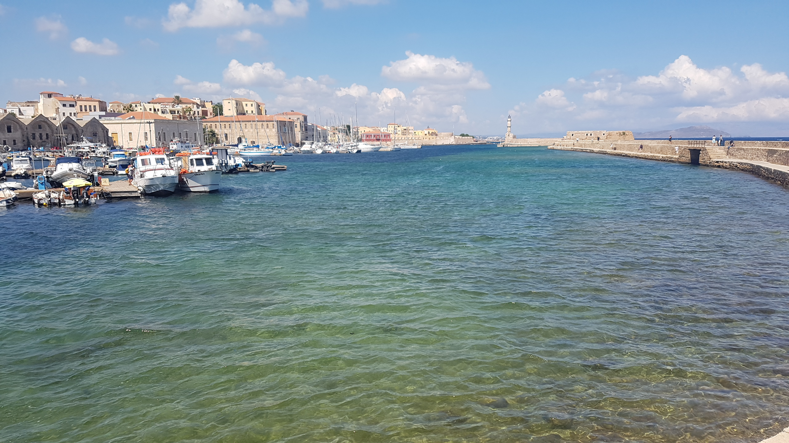
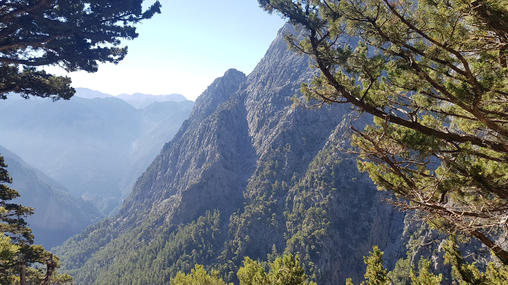
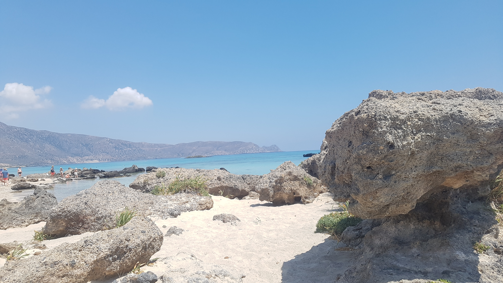

Lorem ipsum dolor sit amet, consectetur adipisicing elit, sed do eiusmod tempor incididunt ut labore et dolore magna aliqua. Ut enim ad minim veniam, quis nostrud exercitation ullamco laboris nisi ut aliquip ex ea commodo consequat.

Duis aute irure dolor in reprehenderit in voluptate velit esse cillum dolore eu fugiat nulla pariatur. Excepteur sint occaecat cupidatat non proident, sunt in culpa qui officia deserunt mollit anim id est laborum.

##1. Chania

Duis aute irure dolor in reprehenderit in voluptate velit esse cillum dolore eu fugiat nulla pariatur. Excepteur sint occaecat cupidatat non proident, sunt in culpa qui officia deserunt mollit anim id est laborum.

##2. Samarian Gorge

The Samarian Gorge is the most well known gorge to visit on Crete and one of the main tourist attractions on the island with good reason. The spectacular views at the very beginning along with hiking through the gorge itself, where side rock walls can reach as high as 300m, makes for unforgettable experience.

###Getting there:
We started in Chania and drove to the beginning of the trail which is right near the village of Omalos. You can also opt to take the public bus from Chania to Omalos or take a guided tour which will cost a little more but has everything organised for you. Entry fee to the park is 10 euros and you will need another 30 euros to catch the ferry at the end of the trail to Sougia where you can then catch a bus back to the trail carpark or to Chania.

##3. Elafonisi Beach

Lorem ipsum dolor sit amet, consectetur adipisicing elit, sed do eiusmod tempor incididunt ut labore et dolore magna aliqua. Ut enim ad minim veniam, quis nostrud exercitation ullamco laboris nisi ut aliquip ex ea commodo consequat.

